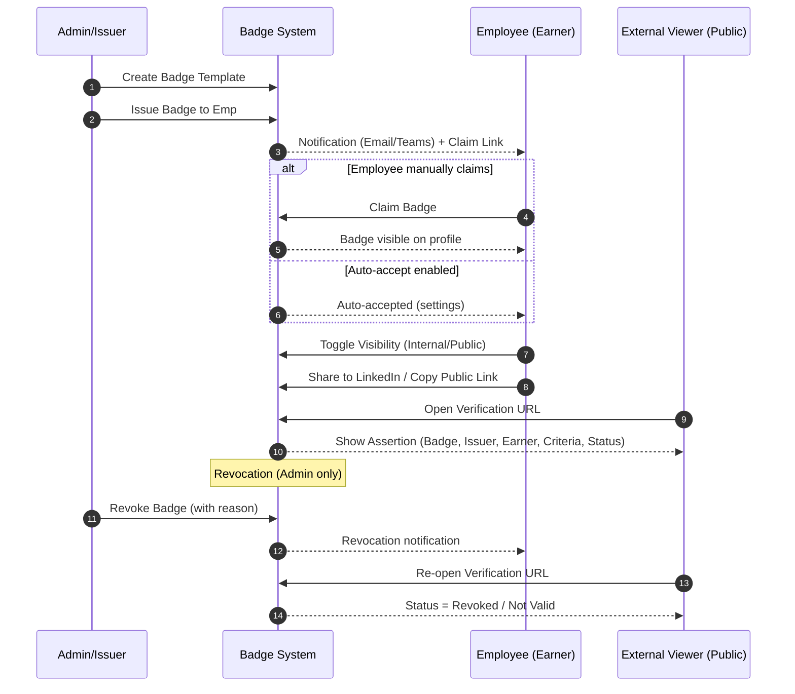
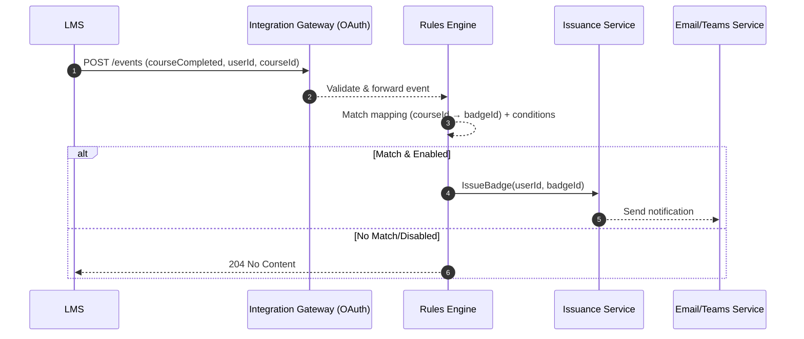

# Internal Digital Credentialing System — Integrated PRD (with Mermaid Diagrams)

**Version:** 1.1  
**Date:** 2026-01-21  
**Owner:** Product Team (Internal L&D / HR / IT)

> This edition appends **Mermaid diagrams** for end-to-end flows, approval workflow, automated issuance, component architecture, and the Open Badges data model.

---

## Table of Contents
1. [Overview](#overview)
2. [Goals & Objectives](#goals--objectives)
3. [Scope](#scope)
4. [Personas](#personas)
5. [Functional Requirements — User Stories & Acceptance Criteria](#functional-requirements--user-stories--acceptance-criteria)
6. [Non-Functional Requirements](#non-functional-requirements)
7. [Technical Architecture Overview](#technical-architecture-overview)
8. [Standards & Data Model (Open Badges 2.0)](#standards--data-model-open-badges-20)
9. [Security, Privacy & Compliance](#security-privacy--compliance)
10. [Milestones & Timeline](#milestones--timeline)
11. [Success Metrics](#success-metrics)
12. [Risks & Mitigations](#risks--mitigations)
13. [Mermaid Diagrams](#mermaid-diagrams)

---

## Overview
(unchanged — see previous version 1.0)

## Goals & Objectives
(unchanged)

## Scope
(unchanged)

## Personas
(unchanged)

## Functional Requirements — User Stories & Acceptance Criteria
(unchanged — see integrated stories in v1.0)

## Non-Functional Requirements
(unchanged)

## Technical Architecture Overview
(unchanged)

## Standards & Data Model (Open Badges 2.0)
(unchanged)

## Security, Privacy & Compliance
(unchanged)

## Milestones & Timeline
(unchanged)

## Success Metrics
(unchanged)

## Risks & Mitigations
(unchanged)

---

## Mermaid Diagrams

> The following diagrams visualize key flows and structures. Copy-paste into any Mermaid-enabled renderer (e.g., GitHub, Azure DevOps, MkDocs with mermaid plugin).

### 1) End-to-End Credential Lifecycle (Issue → Claim → Share → Verify → Revoke)


### 2) Manager Approval Workflow (Nomination → Review → Decision)
```mermaid
flowchart TD
    A[Start Nomination] --> B{Initiator}
    B -->|Admin| C[Submit nomination for employee]
    B -->|Employee (self)| C
    C --> D[Attach evidence/justification]
    D --> E[Route to Manager (M1) or Designated Approver]
    E --> F{Approver Decision}
    F -->|Approve| G[Issue Badge]
    F -->|Decline| H[Notify Nominator + Close]
    G --> I[Notify Earner + Update Profile]
    H --> J[Audit Trail Logged]
    I --> K[Audit Trail Logged]
    K --> L[End]
    J --> L
```

### 3) Automated Issuance via LMS / HRIS Triggers
```mermaid
flowchart LR
    subgraph Sources
      LMS[(LMS)]
      HRIS[(HRIS)]
      App[(Other Apps/Webhooks)]
    end

    subgraph Badge System
      R[Rules Engine]
(Trigger→Badge)
      API[Secure Ingestion API]
(Webhooks/OAuth)
      IssuerSvc[Issuance Service]
      Notif[Notifications]
(Email/Teams)
    end

    LMS -->|CourseCompleted Event| API
    HRIS -->|Milestone Event| API
    App -->|Custom Event| API

    API --> R
    R -->|Match + Conditions OK| IssuerSvc
    IssuerSvc -->|Create Assertion| Notif
    Notif -->|Notify Earner| End[Badge Claimed/Auto-accepted]

    R -.->|Disabled/No Match| NX[No Action]
```

### 4) Component Architecture (Logical)
```mermaid
flowchart TB
    subgraph UI Layer
      Web[Web App (React/TS)]
      Teams[Teams App/Bot]
    end

    subgraph Services (API)
      Auth[Auth & RBAC]
      Badge[Badge Template Service]
      Issue[Issuance Service]
      Earner[Earner Profile Service]
      Verify[Verification Service]
      Analyt[Analytics Service]
      Integr[Integration Gateway]
(APIs/Webhooks)
    end

    subgraph Data Layer
      RDB[(Relational DB)]
      Blob[(Object Storage: Images/Evidence)]
      Cache[(Cache/CDN)]
    end

    Web <--> Auth
    Web <--> Badge
    Web <--> Issue
    Web <--> Earner
    Web <--> Verify
    Web <--> Analyt
    Teams <--> NotifBot[Notifications]
    NotifBot --> Issue

    Integr <--> Issue
    Integr <--> Auth
    Integr <--> Earner

    Badge <---> RDB
    Issue <---> RDB
    Earner <---> RDB
    Verify <---> RDB
    Analyt --> RDB
    Badge --> Blob
    Verify --> Blob
    Web --> Cache
```

### 5) Open Badges 2.0 Data Model (Simplified)
```mermaid
classDiagram
    class Issuer {
      +id: URL
      +name: string
      +url: URL
      +email: string
    }

    class BadgeClass {
      +id: URL
      +name: string
      +description: string
      +image: URL
      +criteria: URL/Text
      +alignment: [URL]
      +issuer: Issuer
      +tags: [string]
      +expires: Date? 
    }

    class Assertion {
      +id: URL
      +type: ["Assertion"]
      +recipient: {hashed? name/email}
      +badge: BadgeClass
      +issuer: Issuer
      +issuedOn: DateTime
      +evidence: [URL]
      +verification: {type, url}
      +expires: Date?
      +revocationReason: string?
      +status: Active|Revoked|Expired
    }

    Issuer <.. BadgeClass
    BadgeClass <.. Assertion
    Issuer <.. Assertion
```

### 6) API Integration Overview (External Systems)


---

*End of Document (v1.1 with Mermaid)*
