# System Architecture Diagrams

Visual documentation of the GCredit Digital Badge Platform architecture.

## Table of Contents

- [System Overview](#system-overview)
- [Component Architecture](#component-architecture)
- [Database Schema](#database-schema)
- [Badge Issuance Flow](#badge-issuance-flow)
- [Authentication Flow](#authentication-flow)
- [Deployment Architecture](#deployment-architecture)

---

## System Overview

High-level system architecture showing main components and interactions.

### Components Description

| Component | Technology | Purpose |
|-----------|------------|---------|
| **Web Client** | React 19 + TypeScript | User interface for badge management |
| **API Server** | NestJS 11 + TypeScript | Backend REST API |
| **Database** | PostgreSQL 16 | Persistent data storage |
| **Blob Storage** | Azure Blob Storage | Badge template images |
| **Email Service** | Azure Communication Services | Badge claim notifications |
| **ORM** | Prisma 6.19 | Database abstraction layer |

---

## Component Architecture

Detailed view of NestJS application architecture.

### Module Dependencies

---

## Database Schema

Entity Relationship Diagram showing database structure.

### Key Relationships

1. **User → Badge (as Issuer):** One user can issue many badges
2. **User → Badge (as Recipient):** One user can receive many badges
3. **BadgeTemplate → Badge:** One template can be used for many badges
4. **BadgeTemplate ↔ Skill:** Many-to-many relationship
5. **Skill → SkillCategory:** Many skills belong to one category
6. **SkillCategory → SkillCategory:** Self-referencing for hierarchy

---

## Badge Issuance Flow

Complete workflow from badge issuance to claim.

```mermaid
sequenceDiagram
    participant Admin as HR Admin
    participant API as NestJS API
    participant DB as PostgreSQL
    participant Email as Azure Email
    participant User as Employee
    
    Admin->>API: POST /api/badges<br/>{templateId, recipientId}
    
    API->>DB: Validate template exists & active
    DB-->>API: Template found
    
    API->>DB: Validate recipient exists
    DB-->>API: Recipient found
    
    API->>API: Generate claim token
    API->>API: Hash claim token
    API->>API: Create Open Badges assertion
    
    API->>DB: Create badge record<br/>status: ISSUED
    DB-->>API: Badge created
    
    API->>Email: Send claim email<br/>with claimUrl & token
    Email-->>User: 📧 Badge claim notification
    
    API-->>Admin: ✅ Badge issued<br/>{badgeId, claimUrl, claimToken}
    
    User->>API: POST /api/badges/:id/claim<br/>{claimToken}
    
    API->>API: Hash provided token
    API->>DB: Find badge by hashed token
    DB-->>API: Badge found
    
    alt Badge already claimed
        API-->>User: ❌ 400 Already claimed
    else Badge expired
        API-->>User: ❌ 410 Badge expired
    else Badge revoked
        API-->>User: ❌ 410 Badge revoked
    else Valid claim
        API->>DB: Update badge<br/>status: CLAIMED<br/>claimedAt: now
        DB-->>API: Badge updated
        API-->>User: ✅ Badge claimed successfully
    end
```

### Badge Status State Machine

---

## Authentication Flow

JWT-based authentication and authorization flow.

```mermaid
sequenceDiagram
    participant Client
    participant API
    participant Guard as JWT Guard
    participant DB as PostgreSQL
    
    Client->>API: POST /auth/login<br/>{email, password}
    
    API->>DB: Find user by email
    DB-->>API: User found
    
    API->>API: Verify password<br/>(bcrypt compare)
    
    alt Invalid credentials
        API-->>Client: ❌ 401 Unauthorized
    else Valid credentials
        API->>API: Generate access token<br/>(15 min expiry)
        API->>API: Generate refresh token<br/>(7 day expiry)
        API->>DB: Store refresh token hash
        API-->>Client: ✅ {accessToken, refreshToken}
    end
    
    Client->>API: GET /api/badges/my-badges<br/>Authorization: Bearer token
    
    API->>Guard: Validate JWT token
    
    alt Invalid/expired token
        Guard-->>Client: ❌ 401 Unauthorized
    else Valid token
        Guard->>API: Extract user from token
        API->>DB: Query badges for user
        DB-->>API: Badges list
        API-->>Client: ✅ {badges}
    end
    
    Note over Client,API: Token expires after 15 minutes
    
    Client->>API: POST /auth/refresh<br/>{refreshToken}
    
    API->>DB: Validate refresh token
    DB-->>API: Token valid
    
    API->>API: Generate new access token
    API->>API: Generate new refresh token
    API->>DB: Update refresh token
    
    API-->>Client: ✅ {accessToken, refreshToken}
```

### Role-Based Access Control

```mermaid
graph TD
    REQUEST[Incoming Request]
    
    REQUEST --> JWT[JWT Auth Guard]
    
    JWT --> VALID{Valid Token?}
    
    VALID -->|No| REJECT1[❌ 401 Unauthorized]
    VALID -->|Yes| EXTRACT[Extract User Role]
    
    EXTRACT --> ROLES[Roles Guard]
    
    ROLES --> CHECK{Has Required Role?}
    
    CHECK -->|No| REJECT2[❌ 403 Forbidden]
    CHECK -->|Yes| ALLOW[✅ Allow Request]
    
    ALLOW --> CONTROLLER[Controller Handler]
    
    style REQUEST fill:#e1f5ff
    style ALLOW fill:#d4f1f4
    style REJECT1 fill:#ffebee
    style REJECT2 fill:#ffebee
```

### User Roles Hierarchy

**Permissions:**
- **ADMIN:** All operations + user management + badge revocation
- **MANAGER:** Team oversight + reporting (future)
- **ISSUER:** Issue badges + view issued badges
- **EMPLOYEE:** Claim badges + view own badges

---

## Deployment Architecture

Production deployment on Azure.

### Environment Configuration

---

## API Request Flow

Detailed request/response flow through the system.

---

## Data Flow: Badge Template Creation

Example of data flow for creating a badge template with image upload.

```mermaid
sequenceDiagram
    participant Client
    participant Controller
    participant Interceptor
    participant Service
    participant Azure
    participant Prisma
    participant DB
    
    Client->>Controller: POST /badge-templates<br/>multipart/form-data
    
    Controller->>Interceptor: File Upload Interceptor
    Interceptor->>Interceptor: Validate file type<br/>(PNG, JPG, GIF, WebP)
    Interceptor->>Interceptor: Validate file size<br/>(< 5MB)
    
    alt Invalid file
        Interceptor-->>Client: ❌ 400 Invalid file
    else Valid file
        Interceptor->>Controller: File validated
        
        Controller->>Service: create(dto, file)
        
        Service->>Azure: Upload image to Blob Storage
        Azure-->>Service: Image URL
        
        Service->>Prisma: Create template record<br/>with imageUrl
        Prisma->>DB: INSERT INTO badge_templates
        DB-->>Prisma: Template created
        Prisma-->>Service: Template object
        
        Service-->>Controller: Template created
        Controller-->>Client: ✅ 201 Created<br/>{template}
    end
```

---

## Scalability Considerations

Future scalability patterns.

---

## Related Documentation

- [System Design Document](./system-design.md)
- [Database Schema Details](./database-schema.md)
- [API Documentation](../../backend/docs/api/README.md)
- [Deployment Guide](../setup/deployment-guide.md)

---

**Diagram Tools:**
- All diagrams created with **Mermaid**
- Renderable in GitHub, VS Code, GitBook
- Editable directly in Markdown

**Last Updated:** January 27, 2026
