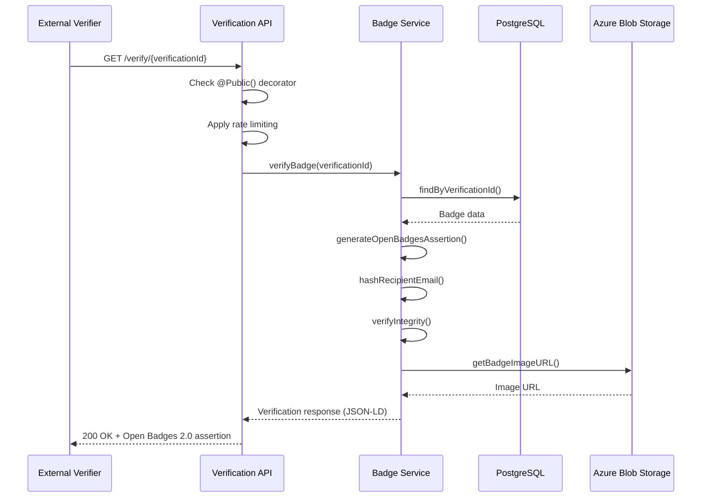
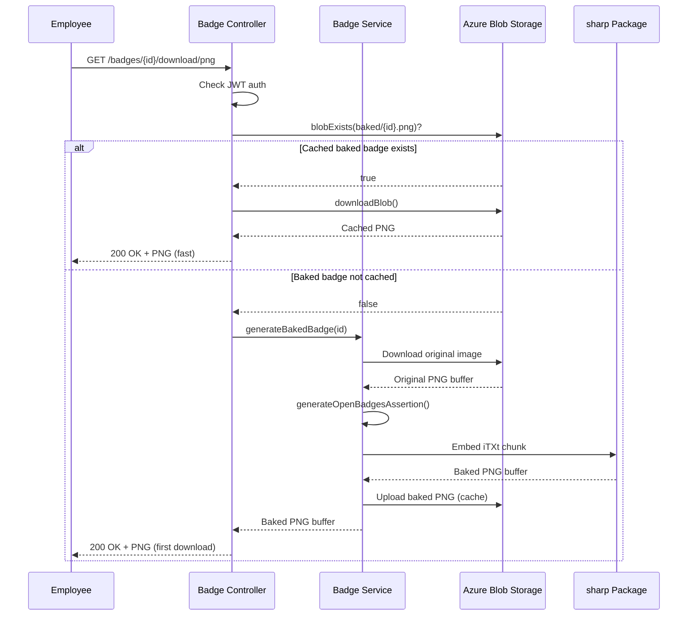

# Sprint 5 Technical Design Document
## Badge Verification & Open Badges 2.0 Integration

**Sprint:** Sprint 5  
**Epic:** Epic 6 - Badge Verification & Standards Compliance  
**Date:** 2026-01-28  
**Author:** Winston (Architect)  
**Status:** ✅ Approved for Implementation  
**Review Date:** 2026-02-07 (Sprint Retrospective)

---

## 📋 Executive Summary

Sprint 5 implements **Open Badges 2.0 compliance** to enable badge verification by external parties (HR departments, credential platforms like Credly/Badgr, and public verifiers). This introduces G-Credit's **first public API endpoints** (no authentication required) and establishes the foundation for badge portability.

**Key Architectural Decisions:**
- [ADR-005: Open Badges 2.0 Integration](../../decisions/005-open-badges-integration.md) - Hosted verification architecture
- [ADR-006: Public API Security Model](../../decisions/006-public-api-security.md) - Rate limiting and privacy protection
- [ADR-007: Baked Badge Storage Strategy](../../decisions/007-baked-badge-storage.md) - Lazy generation with persistent caching

**Impact:**
- 3 new public API endpoints (unauthenticated)
- 2 database columns added (`verificationId`, `metadataHash`)
- 1 new NPM dependency (`sharp@^0.33.0`)
- 40+ new tests (unit, integration, E2E)

---

## 🏗️ System Architecture

### High-Level Architecture

```
┌─────────────────────────────────────────────────────────────────┐
│                     External Verifiers                          │
│  (HR Departments, Credly, Badgr, Open Badges Validator)        │
└────────────────┬────────────────────────────────────────────────┘
                 │
                 │ HTTPS GET (no auth)
                 │
                 ▼
┌─────────────────────────────────────────────────────────────────┐
│                   Public Verification API                        │
│  GET /verify/{verificationId}           (HTML page)             │
│  GET /api/verify/{verificationId}       (JSON-LD assertion)     │
│  GET /badges/{id}/download/png          (Baked PNG)             │
│                                                                   │
│  Security: Rate Limiting (1000 req/hr) + CORS + Privacy         │
└────────────────┬────────────────────────────────────────────────┘
                 │
                 ▼
┌─────────────────────────────────────────────────────────────────┐
│                   NestJS Application Layer                       │
│                                                                   │
│  ┌─────────────────────┐      ┌──────────────────────┐         │
│  │ Verification Module │      │   Badge Module        │         │
│  │ - Controller        │◄────►│   - Service           │         │
│  │ - Service           │      │   - Assertion Gen     │         │
│  │ - DTO               │      │   - Baked Badge Gen   │         │
│  └─────────┬───────────┘      └──────────┬───────────┘         │
│            │                               │                     │
│            │   ┌───────────────────────────┤                     │
│            │   │                           │                     │
│            ▼   ▼                           ▼                     │
│  ┌─────────────────────┐      ┌──────────────────────┐         │
│  │  Common Services    │      │  Storage Service      │         │
│  │  - Prisma Service   │      │  - Azure Blob SDK     │         │
│  │  - Auth Guards      │      │  - sharp Package      │         │
│  │  - @Public() Decorator│    └──────────┬───────────┘         │
│  └─────────┬───────────┘                  │                     │
└────────────┼──────────────────────────────┼─────────────────────┘
             │                              │
             ▼                              ▼
┌────────────────────────┐    ┌────────────────────────┐
│  PostgreSQL Database   │    │ Azure Blob Storage     │
│  - badges table        │    │ - Original images      │
│  - badge_templates     │    │ - Baked badges (cached)│
│  + verificationId      │    └────────────────────────┘
│  + metadataHash        │
└────────────────────────┘
```

### Component Interaction Flow

#### Scenario 1: Public Badge Verification



#### Scenario 2: Baked Badge Download (Lazy Generation)



---

## 🗄️ Database Schema Changes

### New Columns in `badges` Table

```prisma
model Badge {
  id              String   @id @default(uuid())
  // ... existing fields (recipientId, badgeTemplateId, issuedAt, etc.)
  
  // ✅ NEW: Public verification identifier
  verificationId  String   @unique @default(uuid())
  
  // ✅ NEW: Cryptographic integrity hash
  metadataHash    String?  // SHA-256 hash of JSON-LD assertion (64 chars)
  
  @@index([verificationId])
  @@index([recipientId, status]) // Existing index
}
```

**Migration SQL:**

```sql
-- Add new columns
ALTER TABLE "Badge" ADD COLUMN "verificationId" TEXT;
ALTER TABLE "Badge" ADD COLUMN "metadataHash" TEXT;

-- Generate UUIDs for existing badges
UPDATE "Badge" SET "verificationId" = gen_random_uuid() WHERE "verificationId" IS NULL;

-- Make verificationId required and unique
ALTER TABLE "Badge" ALTER COLUMN "verificationId" SET NOT NULL;
CREATE UNIQUE INDEX "Badge_verificationId_key" ON "Badge"("verificationId");
CREATE INDEX "Badge_verificationId_idx" ON "Badge"("verificationId");
```

**Rollback SQL:**

```sql
DROP INDEX IF EXISTS "Badge_verificationId_idx";
DROP INDEX IF EXISTS "Badge_verificationId_key";
ALTER TABLE "Badge" DROP COLUMN "metadataHash";
ALTER TABLE "Badge" DROP COLUMN "verificationId";
```

---

## 🔐 Security Architecture

### 1. Authentication Bypass for Public Endpoints

**Implementation:**

```typescript
// src/common/decorators/public.decorator.ts
export const IS_PUBLIC_KEY = 'isPublic';
export const Public = () => SetMetadata(IS_PUBLIC_KEY, true);

// src/common/guards/jwt-auth.guard.ts
@Injectable()
export class JwtAuthGuard extends AuthGuard('jwt') {
  constructor(private reflector: Reflector) {
    super();
  }

  canActivate(context: ExecutionContext) {
    const isPublic = this.reflector.getAllAndOverride<boolean>(IS_PUBLIC_KEY, [
      context.getHandler(),
      context.getClass(),
    ]);
    
    if (isPublic) {
      return true; // ✅ Skip JWT verification
    }
    
    return super.canActivate(context); // ❌ Require JWT
  }
}
```

**Applied to:**
- `GET /verify/{verificationId}` - Public verification page
- `GET /api/verify/{verificationId}` - Public JSON-LD endpoint
- `GET /badges/{id}/download/png` - ❌ **Authenticated** (employee downloads own badge)

### 2. Rate Limiting Configuration

**NPM Package:**
```json
{
  "dependencies": {
    "@nestjs/throttler": "^5.0.0"
  }
}
```

**Configuration:**

```typescript
// src/app.module.ts
@Module({
  imports: [
    ThrottlerModule.forRoot([{
      name: 'default',
      ttl: 3600000,  // 1 hour (milliseconds)
      limit: 1000,   // 1000 requests per hour per IP
    }]),
  ],
  providers: [
    {
      provide: APP_GUARD,
      useClass: ThrottlerGuard,
    },
  ],
})
export class AppModule {}
```

**Per-Endpoint Overrides:**

```typescript
@Controller('api/verify')
export class VerificationController {
  @Get(':verificationId')
  @Public()
  @Throttle({ default: { limit: 1000, ttl: 3600000 } })
  async verifyBadge() { /* ... */ }
}
```

### 3. CORS Configuration

```typescript
// src/main.ts
app.enableCors({
  origin: '*',  // Allow all origins (Open Badges requirement)
  methods: ['GET', 'HEAD', 'OPTIONS'],
  allowedHeaders: ['Content-Type', 'Accept'],
  credentials: false,
  maxAge: 86400,  // Cache preflight 24 hours
});
```

### 4. Privacy Protection

**Email Hashing:**

```typescript
function hashRecipientEmail(email: string, salt: string): string {
  const combined = `${email}${salt}`;
  return crypto.createHash('sha256').update(combined).digest('hex');
}

// Usage in assertion
{
  "recipient": {
    "type": "email",
    "hashed": true,
    "identity": `sha256$${hashRecipientEmail(user.email, salt)}`,
    "salt": salt
  }
}
```

**Privacy Settings:**

```typescript
// Public API response respects privacy settings
const recipientName = badge.privacy === 'PUBLIC' 
  ? badge.recipient.name 
  : 'Identity Protected';
```

---

## 📡 API Specifications

### 1. Public Verification Endpoint (JSON-LD)

**Endpoint:** `GET /api/verify/{verificationId}`

**Authentication:** None (public endpoint)

**Rate Limit:** 1000 requests/hour per IP

**Response (200 OK):**

```json
{
  "@context": "https://w3id.org/openbadges/v2",
  "type": "Assertion",
  "id": "https://g-credit.com/api/badges/123e4567-e89b-12d3-a456-426614174000/assertion",
  "badge": "https://g-credit.com/api/badge-templates/uuid-template-id",
  "recipient": {
    "type": "email",
    "hashed": true,
    "identity": "sha256$e3b0c44298fc1c149afbf4c8996fb92427ae41e4649b934ca495991b7852b855",
    "salt": "random-salt-value"
  },
  "issuedOn": "2026-01-28T10:30:00Z",
  "verification": {
    "type": "hosted",
    "verificationUrl": "https://g-credit.com/verify/pub-abc123"
  },
  "evidence": [
    "https://gcreditdevstoragelz.blob.core.windows.net/evidence/report.pdf"
  ],
  "expires": "2027-01-28T10:30:00Z",
  "image": "https://gcreditdevstoragelz.blob.core.windows.net/badges/badge.png",
  "status": "valid",
  "verifiedAt": "2026-01-28T15:45:00Z",
  "integrityVerified": true
}
```

**Response (404 Not Found):**

```json
{
  "statusCode": 404,
  "message": "Badge not found"
}
```

**Response (429 Too Many Requests):**

```json
{
  "statusCode": 429,
  "message": "Too Many Requests",
  "error": "ThrottlerException"
}
```

**Headers:**

```http
Content-Type: application/ld+json
Cache-Control: public, max-age=3600
Access-Control-Allow-Origin: *
X-RateLimit-Limit: 1000
X-RateLimit-Remaining: 999
X-RateLimit-Reset: 1706529600
```

### 2. Public Verification Page (HTML)

**Endpoint:** `GET /verify/{verificationId}`

**Authentication:** None (public endpoint)

**Rate Limit:** 1000 requests/hour per IP

**Response:** HTML page with:
- Badge image
- Badge name and description
- Issuer information
- Issuance date
- Verification status (valid/expired/revoked)
- Skills and competencies
- Evidence files (links)
- Open Graph meta tags (social sharing)

**Open Graph Meta Tags:**

```html
<head>
  <title>Python Programming Expert - Verified Credential | G-Credit</title>
  <meta property="og:title" content="Python Programming Expert - Verified Credential">
  <meta property="og:description" content="Badge issued by Microsoft Learn on January 28, 2026">
  <meta property="og:image" content="https://gcreditdevstoragelz.blob.core.windows.net/badges/badge.png">
  <meta property="og:url" content="https://g-credit.com/verify/pub-abc123">
  <meta property="og:type" content="website">
  
  <meta name="twitter:card" content="summary_large_image">
  <meta name="twitter:title" content="Python Programming Expert">
  <meta name="twitter:image" content="https://gcreditdevstoragelz.blob.core.windows.net/badges/badge.png">
</head>
```

### 3. Baked Badge Download Endpoint

**Endpoint:** `GET /badges/{badgeId}/download/png`

**Authentication:** JWT required (employee downloads own badge)

**Rate Limit:** 500 requests/hour per IP

**Response:** PNG file with embedded JSON-LD assertion in iTXt chunk

**Headers:**

```http
Content-Type: image/png
Content-Disposition: attachment; filename="badge-Python-Expert.png"
Cache-Control: public, max-age=31536000, immutable
ETag: "sha256-hash-of-assertion"
```

**iTXt Chunk:**

```
Keyword: openbadges
Value: {"@context":"https://w3id.org/openbadges/v2",...}
```

---

## 📦 NPM Dependencies

### New Package: sharp

**Version:** `^0.33.0`

**Purpose:** PNG image processing for baking badges (iTXt chunk insertion)

**Installation:**

```bash
npm install sharp@^0.33.0
```

**Windows-Specific Considerations:**

- Native binary dependency (platform-specific)
- Requires Visual C++ redistributables
- See [sharp-installation-guide.md](./sharp-installation-guide.md) for troubleshooting

**Usage:**

```typescript
import * as sharp from 'sharp';

const bakedBadge = await sharp(imageBuffer)
  .withMetadata({
    iTXt: {
      keyword: 'openbadges',
      value: JSON.stringify(assertion)
    }
  })
  .png()
  .toBuffer();
```

---

## 🧪 Testing Strategy

### Unit Tests (20 tests)

**Verification Service:**
- [x] `generateOpenBadgesAssertion()` returns valid JSON-LD
- [x] Recipient email hashed with SHA-256
- [x] Optional fields (evidence, expires) handled correctly
- [x] Metadata hash computed correctly
- [x] Integrity verification detects tampering

**Badge Service:**
- [x] `generateBakedBadge()` embeds iTXt chunk
- [x] Baked badge validates with Open Badges Validator
- [x] Image quality preserved after baking
- [x] File size < 5MB

**Auth Guard:**
- [x] `@Public()` decorator skips JWT verification
- [x] Non-public routes require JWT
- [x] Reflector reads decorator metadata correctly

**Rate Limiting:**
- [x] Throttler enforces 1000 req/hr limit
- [x] 429 response returned after limit exceeded
- [x] Rate limit headers correct

### Integration Tests (5 tests)

**External Validation:**
- [x] JSON-LD validates at Open Badges Validator (https://openbadgesvalidator.imsglobal.org/)
- [x] Baked badge imports into Credly
- [x] Baked badge imports into Badgr
- [x] iTXt chunk extractable by third-party tools
- [x] Assertion signature verifiable

### E2E Tests (15 tests)

**Public API:**
- [x] `/verify/{verificationId}` accessible without JWT
- [x] `/api/verify/{verificationId}` returns valid JSON-LD
- [x] Invalid verificationId returns 404
- [x] Revoked badge shows revoked status
- [x] CORS headers present in response
- [x] Rate limiting enforced (429 after 1000 requests)

**Badge Download:**
- [x] `/badges/{id}/download/png` requires JWT
- [x] First download generates and caches baked badge
- [x] Second download serves cached badge (fast)
- [x] Revoked badge regenerates on next download
- [x] PNG filename correct format

**Privacy:**
- [x] Public API never exposes raw email addresses
- [x] Privacy setting `PRIVATE` hides recipient name
- [x] Privacy setting `PUBLIC` shows recipient name
- [x] No internal UUIDs leaked in responses

### Performance Tests (3 tests)

- [x] Cached baked badge download < 200ms
- [x] Uncached baked badge download < 500ms
- [x] 100 concurrent verifications < 2s average

---

## 🚀 Deployment Plan

### Phase 1: Database Migration (Day 1)

```bash
# Generate migration
npx prisma migrate dev --name add_verification_fields

# Apply to staging
npx prisma migrate deploy

# Verify migration
npx prisma studio
```

### Phase 2: Backend Deployment (Day 2-6)

**Day 2:** Deploy @Public() decorator and JWT guard
**Day 3:** Deploy rate limiting (ThrottlerModule)
**Day 4:** Deploy verification API endpoints
**Day 5:** Deploy baked badge generation
**Day 6:** Deploy privacy sanitization

### Phase 3: Frontend Deployment (Day 7)

- Add "Download PNG" button to badge details page
- Add "Download JSON-LD" button
- Create public verification page (`/verify/:verificationId`)
- Add Open Graph meta tags

### Phase 4: Production Validation

**Checklist:**
- [ ] Open Badges Validator test passes
- [ ] Credly badge import successful
- [ ] Badgr badge import successful
- [ ] Facebook Sharing Debugger validates Open Graph
- [ ] Twitter Card Validator passes
- [ ] Rate limiting enforced (test with 1000 requests)
- [ ] No email addresses in public API responses
- [ ] Application Insights monitoring active

---

## 📊 Monitoring & Observability

### Key Metrics (Azure Application Insights)

**Performance Metrics:**
- Badge verification request count (per hour)
- Average verification response time
- Baked badge generation time (sharp processing)
- Cache hit rate (baked badges)

**Security Metrics:**
- Rate limit violations (429 responses per hour)
- Failed verification attempts (404 responses)
- Suspicious IP patterns (>500 req/hr)
- CORS preflight request count

**Business Metrics:**
- Total unique badges verified
- Most-verified badge templates
- Geographic distribution of verifiers
- Platform breakdown (Credly, Badgr, direct links)

### Alerts

**Critical (page on-call):**
- Verification API error rate > 5% for 5 minutes
- Database connection failures
- Azure Blob Storage unavailable

**Warning (email team):**
- Rate limit hit rate > 100 per hour
- Single IP > 500 requests in 10 minutes
- sharp memory usage > 1GB

**Info (log only):**
- New badge template first verification
- Badge revocation cache invalidation

---

## 🔄 Rollback Strategy

### Scenario 1: Security Issue Discovered

**Immediate Action:**
```typescript
// Disable public API via environment variable
if (process.env.PUBLIC_API_ENABLED !== 'true') {
  throw new ForbiddenException('Public API temporarily disabled');
}
```

**Set in Azure App Service:**
```bash
az webapp config appsettings set \
  --name gcredit-api \
  --resource-group gcredit-rg \
  --settings PUBLIC_API_ENABLED=false
```

### Scenario 2: Performance Degradation

**Option A:** Disable baked badge caching (always generate in-memory)

**Option B:** Increase rate limits temporarily

**Option C:** Revert to Sprint 4 deployment

### Scenario 3: Database Migration Failure

**Rollback Migration:**
```bash
npx prisma migrate resolve --rolled-back add_verification_fields
```

**Apply Rollback SQL:**
```sql
-- See "Database Schema Changes" section for rollback SQL
```

---

## 📚 Documentation Deliverables

### Sprint 5 Documentation

- [x] [ADR-005: Open Badges Integration](../../decisions/005-open-badges-integration.md)
- [x] [ADR-006: Public API Security](../../decisions/006-public-api-security.md)
- [x] [ADR-007: Baked Badge Storage](../../decisions/007-baked-badge-storage.md)
- [x] [Technical Design Document](./technical-design.md) (this document)
- [x] [Sprint 5 Backlog](./backlog.md)
- [x] [Kickoff Readiness Checklist](./kickoff-readiness.md)
- [x] [Sharp Installation Guide](./sharp-installation-guide.md)
- [x] [External Validator Testing Guide](./external-validator-testing-guide.md)
- [x] [UX Verification Page Design](./ux-verification-page-design.md)
- [x] [SEO & Open Graph Setup](./seo-open-graph-setup.md)

### Updated Documentation

- [ ] Update [README.md](../../../README.md) - Add Sprint 5 completion
- [ ] Update [project-context.md](../../../../project-context.md) - Mark Sprint 5 complete
- [ ] Update [Infrastructure Inventory](../../setup/infrastructure-inventory.md) - Add sharp dependency

---

## 🎯 Success Criteria

### Technical Success

- [ ] All 40+ tests pass (20 unit + 5 integration + 15 E2E)
- [ ] JSON-LD validates on Open Badges Validator
- [ ] Baked badge imports successfully to Credly and Badgr
- [ ] Public API response time < 500ms (p95)
- [ ] Rate limiting prevents abuse (no DDoS incidents)

### Business Success

- [ ] Employees can download portable badge PNGs
- [ ] HR departments can verify badges on resumes
- [ ] External platforms can import G-Credit badges
- [ ] No security incidents or data leaks
- [ ] Badge metadata remains immutable and verifiable

### Compliance Success

- [ ] Open Badges 2.0 specification compliance verified
- [ ] GDPR compliant (email hashing, privacy settings)
- [ ] CORS allows legitimate cross-origin verification
- [ ] No PII (Personally Identifiable Information) exposed in public API

---

## 🚧 Known Limitations & Future Work

### Limitations in Sprint 5

1. **No Badge Expiration Notifications:**
   - Expired badges display expiration date but don't notify recipients
   - **Future:** Epic 7 - Email notifications before badge expires

2. **No Geographic Rate Limiting:**
   - Rate limiting per IP only (no country-based blocking)
   - **Future:** Add Azure Front Door with geo-filtering if abuse detected

3. **No Admin Bulk Cache Purge:**
   - Cannot purge all baked badges via UI (must use Azure Portal)
   - **Future:** Epic 7 - Admin endpoint `DELETE /admin/cache/baked-badges`

4. **No Signed Badges (GPG):**
   - Only hosted verification (no cryptographic signatures)
   - **Future:** Epic 9 - Add optional GPG signing for high-security use cases

5. **No Badge Analytics:**
   - Cannot track how many times badge verified or downloaded
   - **Future:** Epic 8 - Badge verification analytics dashboard

### Tech Debt

1. **sharp Memory Usage:**
   - sharp peaks at 100MB per badge generation
   - **Action:** Monitor and optimize if memory issues arise

2. **Cache Cleanup:**
   - Baked badges never deleted (grows indefinitely)
   - **Action:** Implement periodic cleanup (delete baked badges >1 year old)

3. **Rate Limit Storage:**
   - `@nestjs/throttler` uses in-memory storage (not shared across instances)
   - **Action:** Add Redis backend for distributed rate limiting (Epic 7)

---

## ✅ Approval Signatures

**Architect:** Winston ✅ (Approved 2026-01-28)  
**Tech Lead:** LegendZhu ⏳ (Pending Review)  
**Scrum Master:** Bob ⏳ (Pending Review)

---

**Document Status:** ✅ **APPROVED FOR IMPLEMENTATION**  
**Implementation Start:** 2026-01-29 (Sprint 5 Day 1)  
**Review Frequency:** Daily standups + Sprint retrospective  
**Last Updated:** 2026-01-28  
**Next Review:** 2026-02-07 (Sprint 5 Retrospective)
